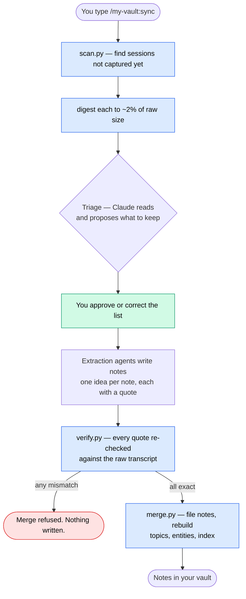

# Turning Claude Code sessions into an Obsidian vault you can trust

Your Claude Code sessions are the most detailed record of your thinking that exists.
Not the code — the code is in git. The *reasoning*: why you picked this vendor, what
you rejected and on what grounds, what a colleague pushed back on, the plan you talked
yourself out of at 1am.

Then Claude Code deletes it. Transcripts are cleaned up after about 30 days by default,
and there is no backup. Ten months of decisions can reduce to a prompt-history file
with no answers in it.

This plugin captures that record into an Obsidian vault before it disappears — as
atomic, interlinked notes, each anchored to a quote that is **machine-verified to be
text somebody actually wrote**.

```
/plugin marketplace add abbaseya/claude-plugins
/plugin install my-vault@abbaseya
```

Then, in Claude Code, **`/my-vault:setup` first** — it finds your vault and asks a
handful of questions. After that, `/my-vault:sync` whenever you want to capture
sessions.

---

## The wrong way (and why it's tempting)

The obvious approach: copy the transcripts into the vault, or ask Claude to "summarise
my sessions into notes."

Both fail, for different reasons.

**Copying doesn't work because transcripts are almost entirely not conversation.** On
the corpus this was built against, 227 sessions came to 379.8 MB. Stripping tool calls,
tool results, file dumps, thinking blocks and subagent chatter left **6.5 MB — 1.7%**.
The rest is machinery. A vault full of raw transcripts is a vault you never open,
because finding the one sentence that mattered means re-reading a 16 MB log.

**Summarising doesn't work because you cannot check it.** A summary is the model's
account of what happened. When you read it back in six months, you have no way to tell
which parts are what you said and which are what the model inferred you meant. A
knowledge base you cannot audit is worse than none — it is a confident,
plausible-sounding record that quietly drifts from the truth.

## The thing that makes it trustworthy

Every note carries a **verbatim quote** from the source, and the summary above it is
clearly the model's wording:

```markdown
## We dropped the managed queue because of the egress bill, not the latency

The migration away from the managed queue was driven by data-transfer costs.
Latency was the stated reason in the announcement, but it was never the deciding
factor.

> "honestly the latency was fine, it's the egress bill that killed it — we were
> paying more to move the messages than to process them"
> — Sam, 2026-06-27, Queue migration retro

Related: [[Egress costs shape architecture]], [[Northwind Systems]]
```

Two layers, visibly separated: the claim in the model's words, the evidence in yours.

**And the evidence is checked mechanically, not on trust.** Before anything reaches
your vault:

1. every blockquote must be a character-exact substring of its declared source, and
2. quotes from a session are re-extracted **straight from the raw `.jsonl`** and matched
   again, independently of the digest the extraction agent actually read.

A single mismatch aborts the entire merge. Nothing partial lands.

### Why this is not paranoia

Language models fabricate most readily when a tool call failed and there is pressure to
produce an answer. A fabricated quote is indistinguishable from a real one by eye — that
is precisely what makes it dangerous. An agent reporting "I verified my quotes" is a
*claim*, not evidence.

There is a second, subtler failure this guards against, and it is worth being concrete
because it happened during development. The first verification pass over a real vault
reported **225 failures out of 283 quotes**. It looked like mass fabrication. It wasn't:
the verifier was including the wrapping quote marks in its substring check, so every
correctly-quoted note "failed". The tell was that the failing quotes contained the
author's own typos — `canebalize`, `nadliing`, `bby` — which a fabricating model would
have silently corrected.

The lesson stuck: **a verifier is only worth what its own tests prove.** So
`tests/test_verify.py` plants fabricated quotes, subtly-altered quotes, quotes lifted
from stripped tool output, and quotes from subagent chatter, and asserts every one is
rejected — plus a correctly-quoted note wrapped in markdown emphasis, asserting it is
*not* rejected. A false positive is as damaging as a miss.

## What you end up with

```
Your Vault/
├── Home.md              entry point: topics, index, how it works
├── 00 Inbox/            yours — never touched
├── 01 Notes/            atomic notes, one idea each
├── 02 Topics/           hubs grouping notes by theme
├── 03 People/           ┐
├── 04 Companies/        ├ entity notes, learned as they appear
├── 07 Entities/         ┘ not yet classified
├── 05 Private/          sensitive notes, quarantined
├── 06 Sessions/         provenance — which note came from where
└── 99 Meta/             the index, plus anything you put here
```

Every note carries frontmatter you can query with Obsidian's own search — no plugins
required:

```yaml
type: decision          # business | pitch | employment | strategy | idea | decision | insight
date: 2026-06-27
tags: [vendor, cost]
sensitivity: private
source_session: 761d7dc6-…
fidelity: verbatim
```

## Setup

**You do not need to edit any files.** Run **`/my-vault:setup`** once after installing.
It walks you through everything, one question at a time. (`/my-vault:sync` will redirect
you here if you try it first, but setup is the front door.)

It will:

1. **Find your Obsidian vault for you.** It reads Obsidian's own registry of vaults
   you've opened, so it can usually just show you a list and ask which one. Knowing your
   vault's folder path is the hardest part of setting up a tool like this, and you never
   have to.
2. **Ask which folders you work in** that should feed that vault, offering the ones it
   found.
3. **Ask what to capture**, as a menu rather than an essay:

   | Preset | Captures |
   |---|---|
   | Everything except technical | Decisions, reasoning, business, strategy, ideas, lessons. No code. |
   | Work knowledge | Decisions and reasoning, direction, trade-offs, commitments. |
   | Business and strategy | Commercial matters, pitches, negotiations, positioning, pricing. |
   | Research | Findings, sources, hypotheses, arguments, conclusions. |

4. **Ask what counts as sensitive** — pay, contracts, anything about named people — and
   quarantine those notes in their own folder.
5. **Look at your vault before proposing how to organise it.** If it already has notes
   from this plugin, setup does *not* invent a new topic taxonomy over the top. It reads
   how the vault is already grouped, derives rules that reproduce it, and tells you what
   percentage they preserve and exactly which notes would still shift. Reorganising is
   offered, never assumed — an organised vault is yours, not the tool's to rearrange.

If you have never made an Obsidian vault: open Obsidian, choose *Create new vault*, pick
a name and a folder, then come back and run setup. That's it.

## How a sync works



**You are in the loop twice**: you start it, and you approve the triage before anything
is extracted. Claude never runs this on its own — the skills are marked
`disable-model-invocation: true`, so only you can trigger them.

### What never happens

- Notes already in your vault are **never modified, moved, or overwritten** — including
  ones you wrote yourself or reorganised. Merge regenerates only the folders it owns.
- Nothing is written when you haven't asked. A `SessionStart` hook tells Claude the
  vault exists and explicitly instructs it not to write there unprompted.
- Running sync twice does not duplicate anything. Merge is idempotent — there is a test
  asserting a second run changes zero bytes.

## Privacy

**Everything stays on your machine.** There is no network call anywhere in this plugin,
no telemetry, no account. The code is stdlib-only Python — CI fails if a dependency
manifest appears — so there is not much surface to audit, and you should audit it.

Three things worth knowing:

- **It reads your entire Claude Code transcript history.** That may include secrets,
  client data, or credentials you pasted. Nothing is uploaded, but notes are written to
  disk, so think about where your vault lives.
- **If you use Obsidian Sync, iCloud, or Dropbox, your vault leaves your machine.** The
  `05 Private/` folder exists so you can exclude sensitive notes from sync — Obsidian
  Sync supports per-folder exclusion. Set it up before your first sync if that matters.
- **The private folder is a filing convention, not encryption.** It marks and separates;
  it does not protect.

## ⚠️ The 30-day problem

Claude Code deletes transcripts after roughly 30 days by default. `cleanupPeriodDays` is
unset out of the box, and there is no backup.

**A session you don't capture within 30 days is gone.** Your prompts survive in
`~/.claude/history.jsonl`, but with no replies and no outcomes — you get "I was thinking
about X on this date" and nothing about what was decided.

If you sync infrequently, set a longer retention in `~/.claude/settings.json`:

```json
{ "cleanupPeriodDays": 365 }
```

The plugin will mention this once. It will not change the setting for you.

## Configuration

Setup writes this for you; you only need it if you want to hand-tune. It lives at
`~/.claude/my-vault/config.json` — **outside the plugin**, so updating the plugin never
touches it.

```jsonc
{
  "version": 1,
  "user": { "name": "Sam Rivera", "pronouns": "they/them" },
  "vaults": [{
    "id": "work",
    "name": "Work",
    "path": "~/Documents/Obsidian/Work",
    "watch":     ["~/Projects/acme"],   // sessions started here feed this vault
    "documents": ["~/Projects/acme"],   // also mine .md files here for notes
    "topics": [
      { "title": "MOC — Decisions", "types": ["decision"], "tags": [] },
      { "title": "MOC — Money",     "types": [], "tags": ["cost", "pricing"] },
      { "title": "MOC — Everything Else", "fallback": true }
    ]
  }],
  "scope": { "preset": "everything-except-technical" },
  "sensitivity": { "private_when": ["compensation", "contracts", "unannounced deals"] }
}
```

A note joins a topic when its `type` **or** any of its `tags` match. Exactly one topic
must be marked `fallback` so nothing is ever orphaned — configuration is validated on
every run and tells you in plain words what is wrong.

**Multiple vaults** work: give each its own `watch` paths. Longest match wins, so a
nested folder can override a broader one. Note that Obsidian wikilinks do not resolve
across vaults, so cross-vault references are written as plain text.

Other data files, all alongside the config:

| File | What it holds |
|---|---|
| `entities.json` | People and organisations, learned as they appear |
| `state.json` | Which sessions have been captured |
| `run/` | Transient working files, cleared by each scan |

### Entities learn themselves

The plugin ships no list of your colleagues, because it cannot have one and you should
not have to write one. When a note references `[[Dana Fields]]`, merge records the name
with `kind: unknown` and files a placeholder note so the link resolves. The sync report
then offers to classify them, and Claude fills in person-vs-organisation and a one-line
role **grounded only in what the notes actually say**. It never invents a role. Once
classified, entities move to `03 People/` or `04 Companies/` on the next sync.

## Manual install

If you would rather not use the plugin system, clone the repo and point Claude Code at
it with `--plugin-dir`, or copy `skills/` and `scripts/` into `~/.claude/skills/`. You
will then need to register the `SessionStart` hook in `~/.claude/settings.json` yourself
— see `hooks/hooks.json` for the shape. The plugin path exists so you don't have to do
that.

## Honest limits

- **Claude Code transcripts only.** Not Codex, not claude.ai, not Cursor.
- **The default topics will be mediocre for you** until you edit them. They cannot know
  what your work is about.
- **Triage is a judgement call and will sometimes drop something you wanted.** That is
  why it shows you the list and waits. Read it.
- **Verified does not mean important.** The guarantee is that a quote is real, not that
  the note was worth keeping.
- **macOS and Linux are tested in CI.** Windows is not claimed — path handling there is
  untested and I would rather say so than pretend.
- **Anything older than your retention window is already gone** and no tool can recover
  it.

## Development

```bash
bash bin/run-tests.sh     # leak gate, imports, 92 tests
ruff check .
```

CI runs the same script on every pull request, on Ubuntu and macOS. Nothing is pushed
to `main` directly.

The suite is written around the failure modes that matter rather than line coverage:
fabricated quotes must be rejected, merge must be idempotent, a user's own notes must
survive a regeneration pass, config must fail loudly, and `bin/check-leaks.py` must fail
the build if a personal name or local path reaches this public repo — with a test that
plants one to prove the gate works.

## License

MIT — see [LICENSE](LICENSE).
